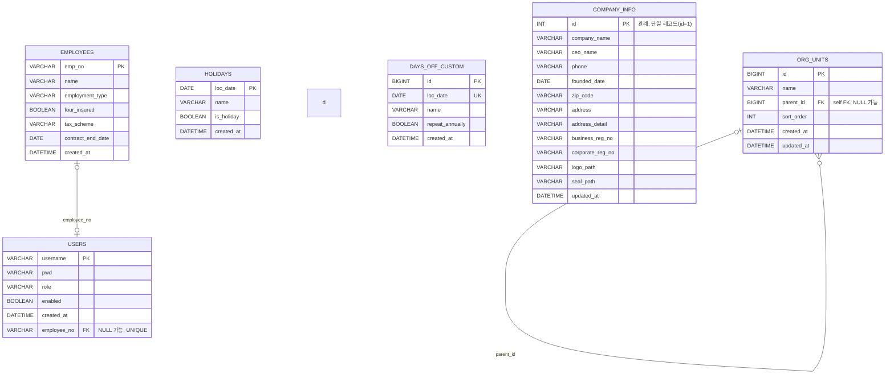

## ERD (현재 schema.sql 기준)

아래 ERD는 `src/main/resources/schema.sql`에 정의된 테이블을 기준으로 작성되었습니다.

## 컬럼 의미(데이터 사전)

### `employees` (직원 기본 정보)

| 컬럼 | 타입 | 의미 | 비고 |
|---|---|---|---|
| `emp_no` | VARCHAR(30) | 사번(직원 식별자) | PK |
| `name` | VARCHAR(50) | 직원 이름 |  |
| `employment_type` | VARCHAR(20) | 고용 형태 | 예: `REGULAR`(정규직), `CONTRACT`(계약직), `FREELANCER`(프리랜서) |
| `four_insured` | BOOLEAN | 4대 보험 가입 여부 |  |
| `tax_scheme` | VARCHAR(30) | 세금 계산 방식 | 예: `SALARY_WITHHOLDING`(근로소득/원천징수), `BUSINESS_INCOME_3_3`(사업소득 3.3%) |
| `contract_end_date` | DATE | 계약 종료일 | 계약직/프리랜서 등에 사용(없을 수 있음) |
| `created_at` | DATETIME | 생성일시 | 기본값: 현재시각 |

### `users` (로그인 계정)

### `users` (로그인 계정 )
| 컬럼 | 타입 | 의미 | 비고 |
|---|---|---|---|

| `username` | VARCHAR(50) | 로그인 아이디 | PK |
| `pwd` | VARCHAR(255) | 비밀번호(해시) | 평문 저장 금지 |
| `role` | VARCHAR(20) | 권한(Role) | 기본값: `USER` (예: `ADMIN`, `USER`) |
| `enabled` | BOOLEAN | 계정 활성화 여부 | 기본값: `TRUE` |
| `created_at` | DATETIME | 생성일시 | 기본값: 현재시각 |
| `employee_no` | VARCHAR(30) | 연결된 사번 | FK → `employees.emp_no`, **NULL 가능**, **UNIQUE**(직원 1명당 계정 최대 1개) |

### `holidays` (법정/공공 공휴일)

| 컬럼 | 타입 | 의미 | 비고 |
|---|---|---|---|
| `loc_date` | DATE | 날짜 | PK |
| `name` | VARCHAR(50) | 공휴일 이름 | 예: 설날, 광복절 등 |
| `is_holiday` | BOOLEAN | 공휴일 여부 | 기본값: `TRUE` |
| `created_at` | DATETIME | 생성일시 | 기본값: 현재시각 |

### `days_off_custom` (사내 커스텀 휴무)

| 컬럼 | 타입 | 의미 | 비고 |
|---|---|---|---|
| `id` | BIGINT | 커스텀 휴무 ID | PK, AUTO_INCREMENT |
| `loc_date` | DATE | 휴무 날짜 | **UNIQUE**(같은 날짜 중복 등록 방지) |
| `name` | VARCHAR(50) | 휴무 이름 | 예: 창립기념일, 워크샵 등 |
| `repeat_annually` | BOOLEAN | 매년 반복 여부 | `TRUE`면 해마다 같은 월/일에 반복 휴무로 해석 |
| `created_at` | DATETIME | 생성일시 | 기본값: 현재시각 |

### `company_info` (회사 정보)

| 컬럼 | 타입 | 의미 | 비고 |
|---|---|---|---|
| `id` | INT | 회사 정보 레코드 ID | PK, 관례상 단일 레코드(`id=1`) |
| `company_name` | VARCHAR(100) | 회사명 |  |
| `ceo_name` | VARCHAR(50) | 대표자명 |  |
| `phone` | VARCHAR(30) | 회사 전화번호 |  |
| `founded_date` | DATE | 설립일 |  |
| `zip_code` | VARCHAR(10) | 우편번호 |  |
| `address` | VARCHAR(255) | 주소(기본 주소) |  |
| `address_detail` | VARCHAR(255) | 상세주소 |  |
| `business_reg_no` | VARCHAR(30) | 사업자등록번호 |  |
| `corporate_reg_no` | VARCHAR(30) | 법인등록번호 |  |
| `logo_path` | VARCHAR(255) | 로고 이미지 경로 | 예: `/uploads/...` 형태의 상대 경로 |
| `seal_path` | VARCHAR(255) | 직인/도장 이미지 경로 | 예: `/uploads/...` 형태의 상대 경로 |
| `updated_at` | DATETIME | 수정일시 | UPDATE 시 자동 갱신 |

### `org_units` (조직/부서 트리)

| 컬럼 | 타입 | 의미 | 비고 |
|---|---|---|---|
| `id` | BIGINT | 조직(부서) ID | PK, AUTO_INCREMENT |
| `name` | VARCHAR(100) | 조직/부서명 |  |
| `parent_id` | BIGINT | 상위 조직 ID | FK → `org_units.id`, **NULL 가능**(루트 조직) |
| `sort_order` | INT | 정렬 순서 | 기본값: `0` |
| `created_at` | DATETIME | 생성일시 | 기본값: 현재시각 |
| `updated_at` | DATETIME | 수정일시 | UPDATE 시 자동 갱신 |

## 관계 요약

- **`users` ↔ `employees`**: `users.employee_no`가 `employees.emp_no`를 참조
  - `users.employee_no`는 **NULL 가능**
  - `users.employee_no`에 **UNIQUE**가 있어 **직원 1명당 계정 최대 1개** 구조(옵션 1:1)
- **`org_units` 자기참조**: `org_units.parent_id`가 `org_units.id`를 참조
  - 루트 노드는 `parent_id = NULL`

